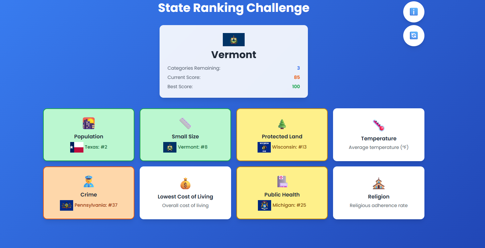

# US States Ranking Game
A fun and educational React game that challenges players to identify which categories US states rank best in. Test your knowledge of state statistics while learning interesting facts about America!



## 🎮 How to Play
1. **Start the Game** - Click "Start Game" to begin
2. **View the State** - A random US state appears with its flag
3. **Choose Wisely** - Select the category where that state ranks **best** (lowest number = best ranking)
4. **Build Your Score** - Your total score is the sum of all rank numbers
5. **Aim Low** - Lower scores are better! Try to beat your personal best

## 📊 Categories Explained
| Category | Icon | What Rank #1 Means |
|----------|------|-------------------|
| Population | 🌇 | Most populated state |
| Small Size | 📏 | Smallest land area |
| Protected Land | 🌲 | Highest % of protected land |
| Temperature | 🌡️ | Highest average temperature |
| Crime | 👮 | Highest crime rate |
| Cost of Living | 💰 | Lowest cost of living |
| Public Health | 🏥 | Best health outcomes |
| Religion | ⛪ | Highest religious adherence |

## 🛠️ Tech Stack
- **Frontend Framework**: Next.js 15 (React 18)
- **Language**: TypeScript
- **Styling**: Tailwind CSS
- **State Management**: React Hooks (useState, useEffect)
- **Data Storage**: localStorage

### Installation
```bash
# Clone the repository
git clone https://github.com/yourusername/us-states-game.git
# Navigate to project directory
cd us-states-game
# Install dependencies
npm install
# Start development server
npm run dev
```
Open [http://localhost:3000](http://localhost:3000) in your browser to play!

## ✨ Features
- **🎯 Smart Scoring**: Lower scores are better - challenge yourself!
- **🏆 Personal Bests**: Track your best score with localStorage persistence
- **💡 Learning Mode**: See optimal choices after each round
- **📱 Responsive Design**: Works on desktop, tablet, and mobile
- **🎨 Visual Feedback**: Color-coded rankings and smooth animations
- **ℹ️ Help System**: Built-in game info and strategy tips
- **🔄 Quick Restart**: Reset button for instant new games

**Enjoy the game and learn something new about US states!** 🎉
